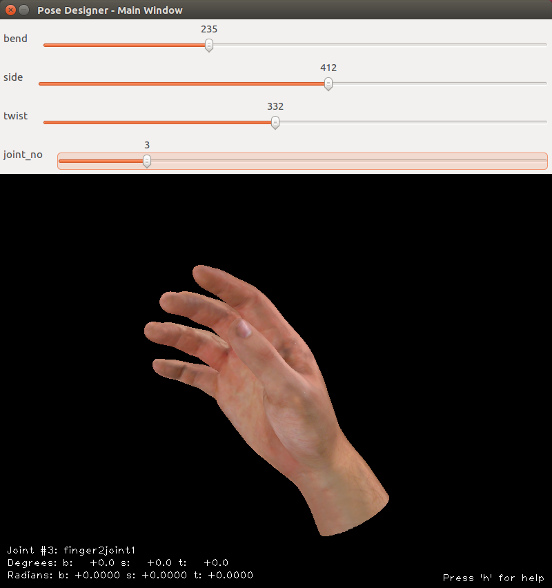
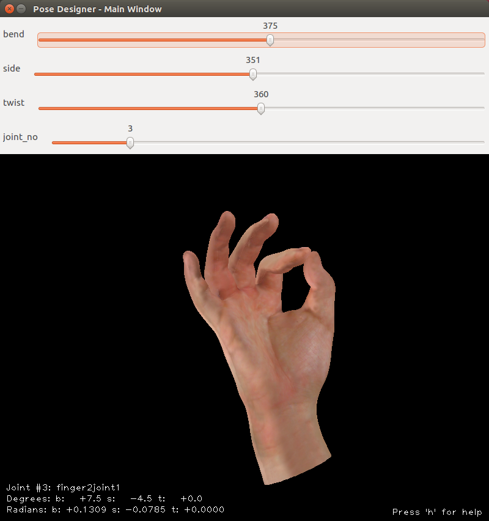
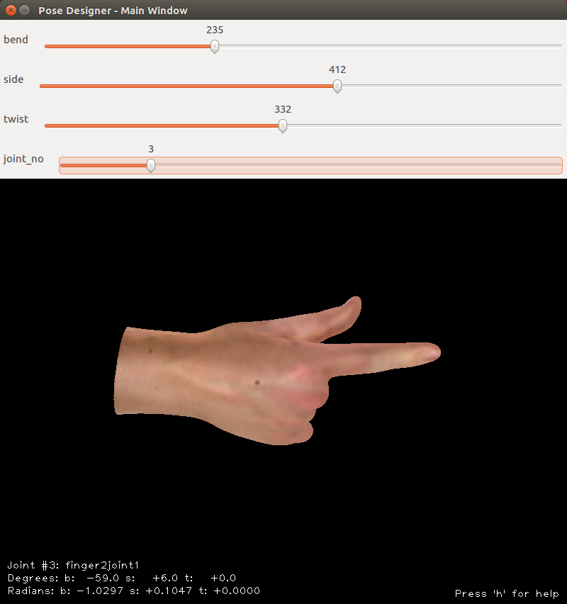
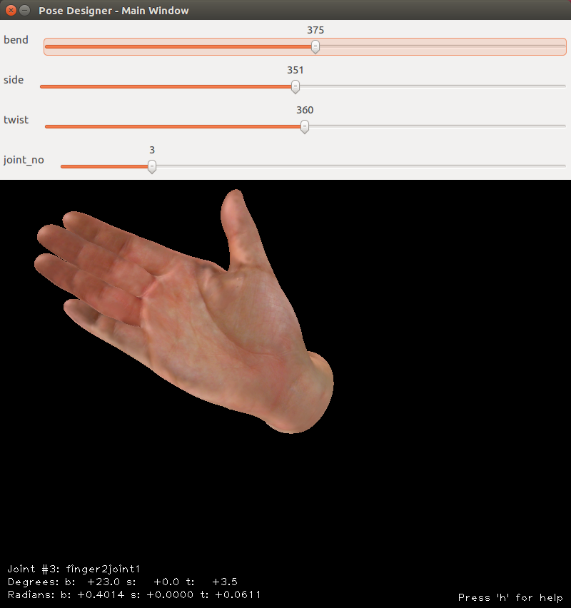
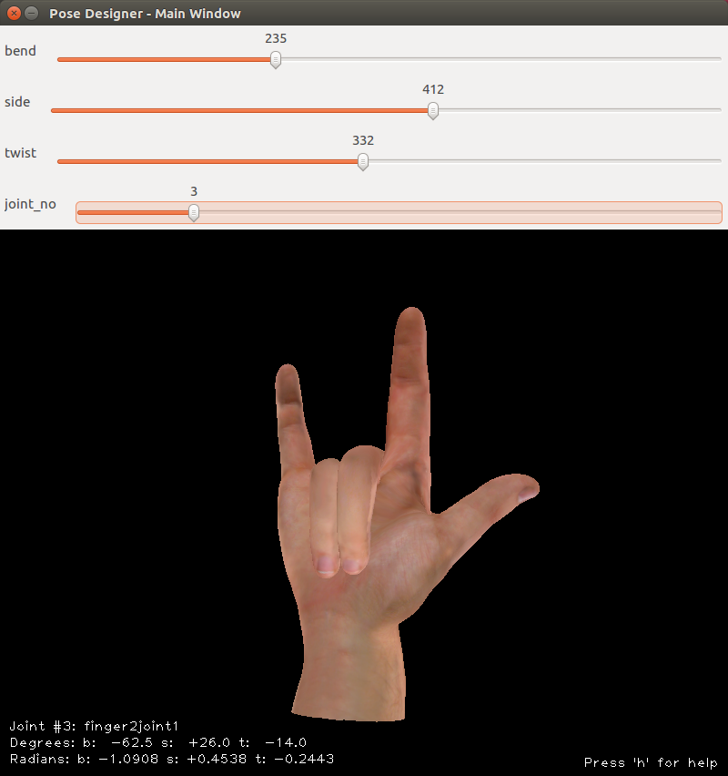
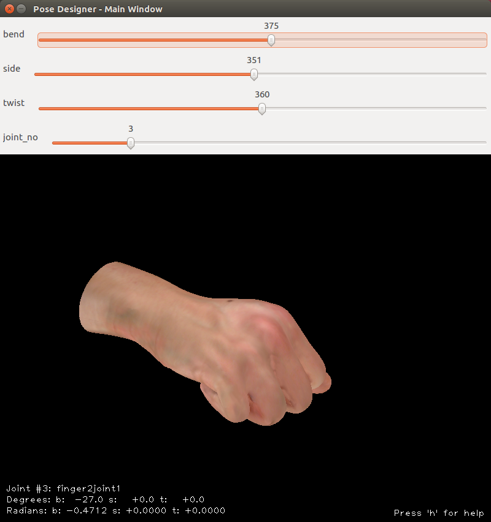
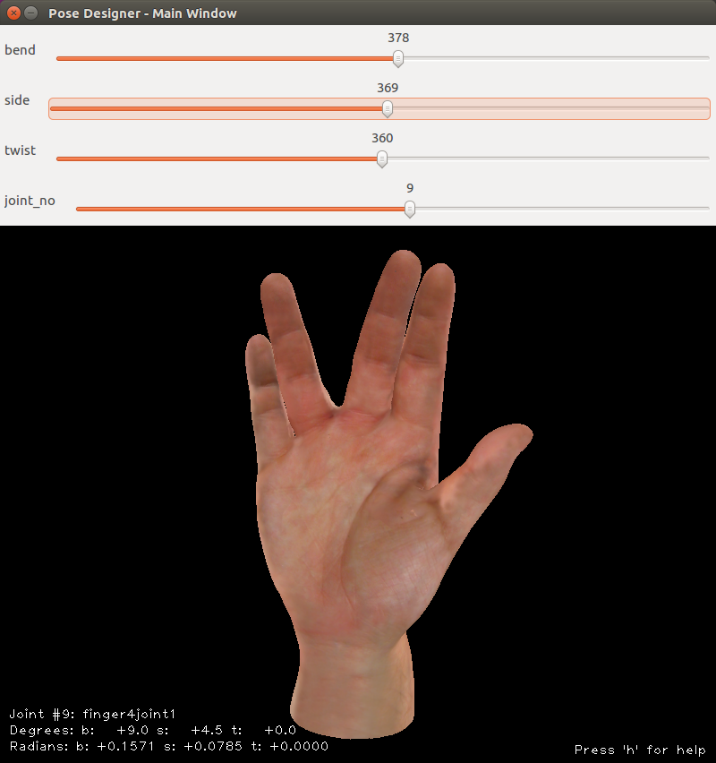

# LibHand [](https://travis-ci.org/libhand/libhand) [](https://ci.appveyor.com/project/libhand/libhand)

<a href="docs/images/relaxed_large.png"></a>
<a href="docs/images/a_ok_large.png"></a>
<a href="docs/images/pointing_large.png"></a>
<a href="docs/images/stop_it_large.png"></a>
<a href="docs/images/rock_on_large.png"></a>
<a href="docs/images/fist_large.png"></a>
<a href="docs/images/vulcan_salute.png"></a>
<a href="docs/images/thumbs_up.png"></a>

## About LibHand

LibHand is an open-source permissively licensed portable library for
rendering articulations of human hand. The goal of LibHand is to provide
as simple programming interface as possible to manipulate human hand pose
information, render a human hand and analyze the resulting image.

Potential scientific applications include computer graphics, computer
vision, robotics, and research into human prosthethic devices. Potential
educational and entertainment applications include integration in interactive
virtual reality applications such as games.

LibHand is available at <http://www.libhand.org/>
Feel free to contact LibHand's author Marin Saric at: marin.saric@gmail.com,
or the LibHand maintainer Shasheen Ediriweera at: shasheene@gmail.com

LibHand is implemented in C++ and offers an interface to facilitate
experimentation. 
By leveraging OGRE, a modern 3D engine, LibHand can render, deform and
analyze a realistic 70k+ triangle hand model at high framerates on mid-range
computer hardware.

LibHand provides OpenCV-friendly interfaces to make it very easy for the
Computer Vision and Robotics community to use it in their research. LibHand
is designed to make it easier to reproduce and extend the research in areas
such as hand grasping, hand pose recognition, hand gesture recognition,
visual servoing, etc.

Additionaly LibHand provides a realistic Human Hand 3D model available in
Blender and OGRE formats under a very permissive [license](#license).

The LibHand was inspired by concepts from recent research in human hand to
robot grasping.

## Installing

### Supported platforms
LibHand v0.9.z is currently actively developed and/or supported on
- Debian Jessie x86_64 and armhf
- Ubuntu 12.04/14.04/16.04 x86_64 systems.
- Windows 7/8/10 x86_64

Any Debian/Ubuntu derivative (such as Linux Mint) should of course work fine without any modifications to the instructions. See below for detailed instructions.

Other POSIX operating systems, and Linux distributions, CPU architectures etc should work fine, assuming you can satifying the software dependencies.

MacOS X support is currently unmaintained. LibHand v0.9.z's Matlab bindings are also unmaintained. Historical information can be found in the out-of-date and deprecated INSTALL.txt file. Matlab bindings may either updated or removed entirely in a subsequent LibHand release.

### Software dependencies
LibHand v0.9.0 was released by Marin Saric in 2011 after being developed against following dependencies
- [OpenCV](https://en.wikipedia.org/wiki/OpenCV) (Open Source Computer Vision) v2.3.y
- [OGRE](https://en.wikipedia.org/wiki/OGRE) (Object Orientated Graphics Rendering Engine) v1.7.4
	- OpenGL headers (GL/glu.h)
- [Tcl/Tk](https://en.wikipedia.org/wiki/Tcl) (likely v8.5.y)
- [CMake](https://en.wikipedia.org/wiki/CMake) v2.8.6
- [Boost](http://www.boost.org/) (likely v1.46.y)

LibHand v0.9.z is currently developed against the highest common dependency version that is easily accessible on the supported platforms. Building against newer dependency versions may work fine, of course. 

### Building LibHand
- See [Building LibHand on Debian/Ubuntu (and derivatives)](docs/build_instructions/debian/BUILD.DEBIAN.md)
- See [Building LibHand on Windows](docs/build_instructions/windows/BUILD.WINDOWS.md)

# What's contained in this distribution?

Here is a general overview of the LibHand directory structure.

- hand_cpp - compile this first.
 The hand_cpp directory provides the LibHand C++ library and the
 pose_designer utility. 

The pose_designer utility can be used to "test drive" LibHand and experiment
with different hand poses.

- hand_model - this is the main hand 3D data directory. There is a
  "scene_spec.yml" file that is used by the LibHand software to load in the
  hand 3d scene, the hand 3D mesh, textures, skeletons, etc. 

- examples - this directory contains the tutorial code with detailed
  comments. The examples directory requires the hand_cpp directory to be
  compiled and setup first

- hand_matlab - contains the interface code for MATLAB, along with MATLAB
  examples. To compile hand_matlab, you need a recent version of MATLAB that
  is setup to compile with mex. Make sure you can compile C the example code
  that comes with your installation of MATLAB before trying to compile
  the LibHand MATLAB interface. Alternatively, you can download a
  pre-compiled MATLAB binary from <http://www.libhand.org/>

- poses - contains some example hand poses as YAML files, to be used with
  the pose_designer and the example code for both C++ and MATLAB.

## Citation

If this software or its derivative is used to produce an academic
publication, you are required to cite this work by using the following
citation or an alternate form provided on "http://www.libhand.org/":

```
    @misc{libhand,
      author = "Marin \v{S}ari\'{c}",
      title = "LibHand: A Library for Hand Articulation",
      year = "2011",
      url = "http://www.libhand.org/",
      note = "Version 0.9"
    }
```

## License

LibHand is available under a derivative of a BSD-license that requires the
academic community to provide attribution to LibHand by means of
citations. Essentially, you can use, modify and sell LibHand or the derived
software in academic and non-academic, commercial and non-commercial,
open-source and closed-source settings, but you have to give proper
credit. Please see the license.txt file for the exact licensing information.

## The Hand 3D Model License

LibHand comes with a textured, rigged and skinned realistic model of a human
hand. The LibHand 3D Hand Model is located in the hand_model directory and
it's available under the Creative Commons Attribution 3.0 Unported License.

Please see the hand_model_license.txt file in the hand_model directory for
the exact licensing information.

Copyright (c) 2011, Marin Saric <marin.saric@gmail.com>
All rights reserved.

This file is a part of LibHand. LibHand is open-source software. You can
redistribute it and/or modify it under the terms of the LibHand license. The
LibHand license is the BSD license with an added clause that requires
academic citation. You should have received a copy of the LibHand license
(the license.txt file) along with LibHand. If not, see
<http://www.libhand.org/>

## Copyright
```
LibHand v0.9
Copyright (c) 2011, Marin Saric <marin.saric@gmail.com>
All rights reserved.
http://www.libhand.org/

LibHand v0.9.z
Copyright (c) 2014-, Various Authors
Maintainer: Shasheen Ediriweera <shasheene@gmail.com>
All rights reserved.
http://github.com/libhand/libhand -- the most up-to-date information on LibHand.
```

